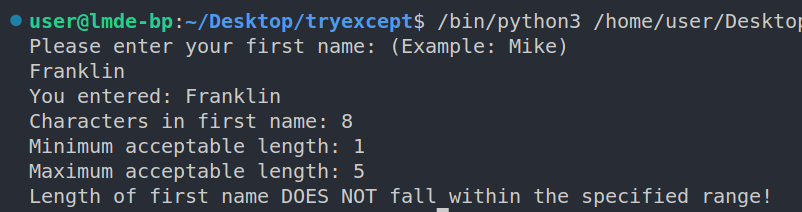
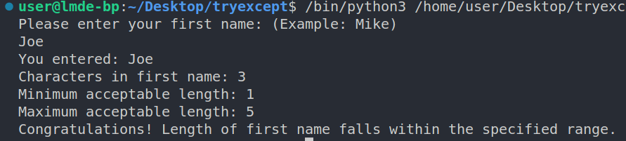

#  Range Validation Function

## Helpful Resources

---
Review these resources before you start writing code for this project:

- [Python Validation: Range Check Tutorial](https://www.youtube.com/watch?v=817xAvEOEN8)
- [Using Booleans in an IF Statement in Python](https://bobbyhadz.com/blog/python-using-boolean-in-if-statement)

---

## Overview

Write a script that contains two functions.

|   	|   Function 1 	| Function 2   	|
|---	|---	|---	|
|  Name 	|  is_valid_input ( ) |  show_output( ) 	|
|  Parameters 	|  input, min_value, max_value 	|  input, min_value, max_value, range_check 	|

- Function 1
  - Does user's first name meet the specified minimum and maximum length?
- Function 2
  - Displays:
    - user's first name
    - number of characters in user's name
    - minimum acceptable length of first name
    - maximum acceptable length of first name
    - message informing user that length of first name does/does not fall within the specified number of characters
- Use variables to store the numbers representing the:
  - minimum acceptable length of first name
  - maximum acceptable length of first name
- Optional feature:
  - Use a main ( ) function as a container for your function calls
  - Don't forget to *call* the main ( ) function if you add one to your script

---

## Sample Output

